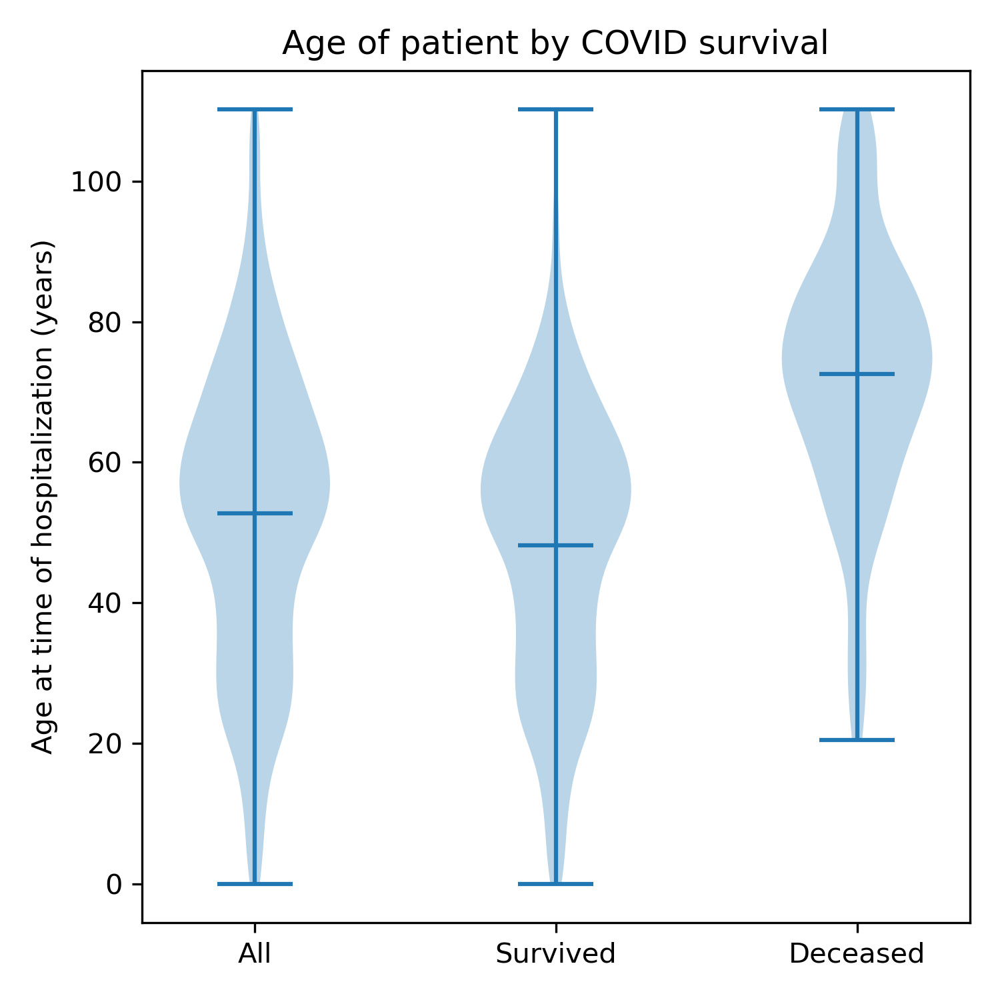

# COVID-19 Data Analysis

Basic modeling with Real-World Data.

### Data

The data is a sample of research data provided by ConcertAI. I don't have permission to share it publicly. Note that all PII is random in the data (e.g. names and addresses are random).

The structure of the data is visible in the analysis notebooks, and a sample is contained in the test resources (`tests/resources/`).

### Installation

This repository uses `poetry` as its package manager, coordinated by `make`.

To install `poetry` and needed dependencies, run `make install`.

To run tests, run `make test`.

A few useful commands:

 - `poetry run <command>` - Run the given command, e.g. `poetry run pytest` invokes the tests.
 - `source $(poetry env info --path)/bin/activate` - An alternative to `poetry shell` that's less buggy in conda environments.
